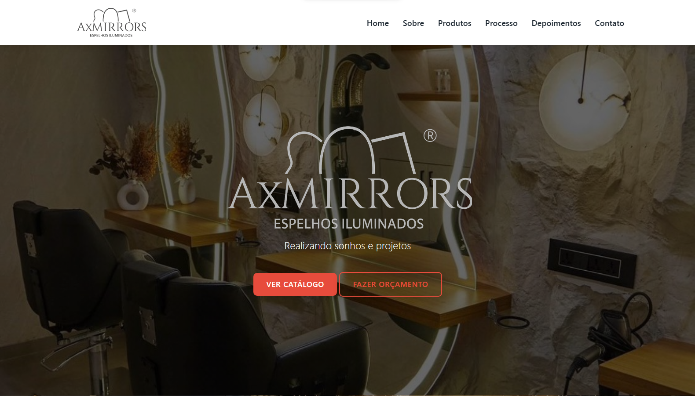
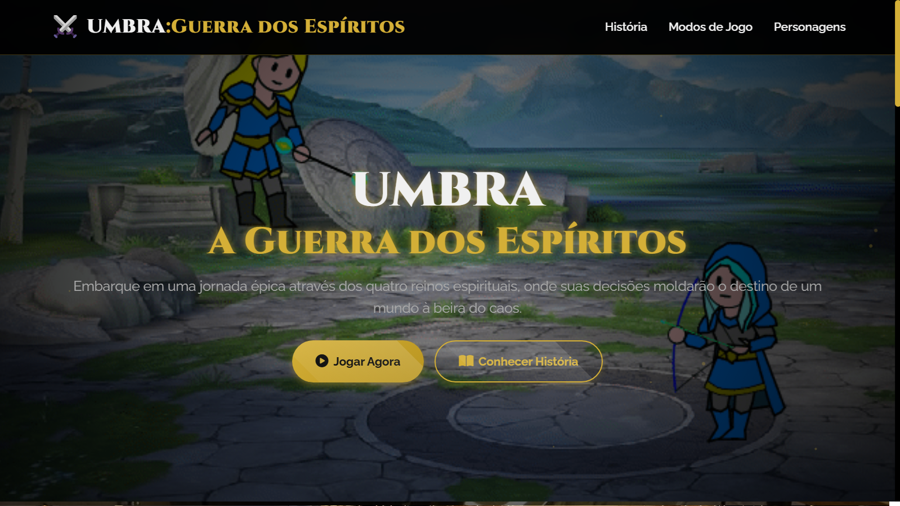
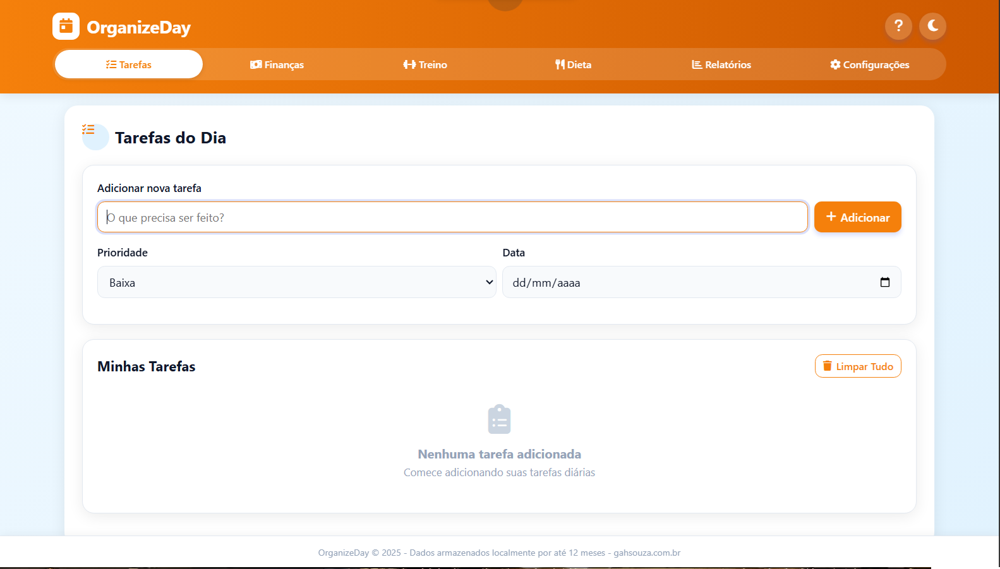
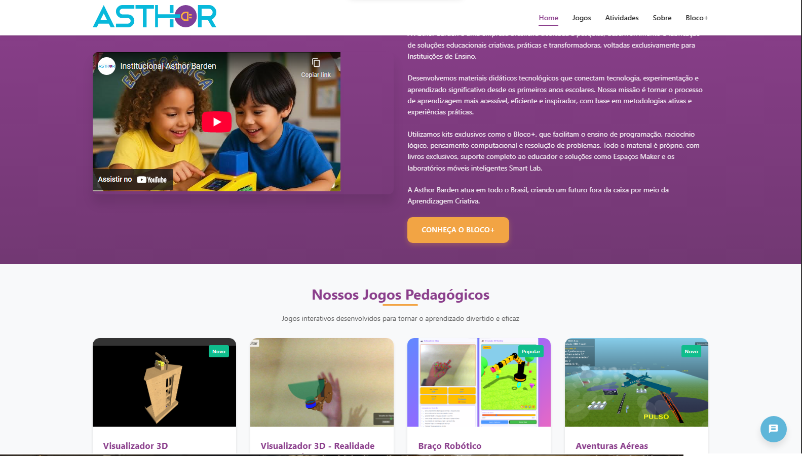

<!-- Início da imagem de cabeçalho gerada pelo Capsule Render -->

<!-- Animação de texto digitado -->

<!-- Sobre -->

Desenvolvedor e entusiasta em robótica com uma jornada que começou na infância. Tive meu primeiro contato com Arduino ainda no ensino fundamental, o que despertou minha paixão por robótica e tecnologia. Autodidata desde cedo, fui me aperfeiçoando e me destaquei em equipes de robótica no ensino médio. Fiz um curso técnico de Eletrotécnica, aprofundando meus conhecimentos em hardware, e atualmente estou cursando Engenharia de Software. Trabalho como desenvolvedor fullstack em uma empresa focada em robótica educacional, onde ajudo a tornar a tecnologia acessível para crianças. Com o uso de materiais recicláveis, procuro desmistificar a robótica, quebrando barreiras e promovendo a sustentabilidade desde a base.

<!-- Seção de habilidades principais com badges visuais -->
## ✨ Habilidades Técnicas:

&nbsp;
&nbsp;
&nbsp;
&nbsp;
&nbsp;
&nbsp;
&nbsp;
&nbsp;
&nbsp;

<!-- Seção destacando os principais projetos -->
## 🌟 Projetos em Destaque

### 1. [AxMirrors - E-commerce de Espelhos Iluminados](https://axmirrors.com.br/)
Site profissional de e-commerce desenvolvido para a AxMirrors, especializada em espelhos iluminados artesanais. O projeto inclui catálogo de produtos, processo de fabricação, depoimentos e sistema de orçamento.

**Tecnologias:** HTML5, CSS3, JavaScript, PHP, Design Responsivo  
**Recursos:** 
- Catálogo de produtos organizado por categorias
- Sistema de solicitação de orçamentos
- Galeria de processo de fabricação
- Seção de depoimentos de clientes
- Design moderno e totalmente responsivo

  

### 2. [Umbra: Guerra dos Espíritos - Jogo Épico](https://gahsouzadev.github.io/UMBRA/)
Jogo épico 2D com três modos de jogo emocionantes e 21 personagens únicos. Embarque em uma jornada através dos quatro reinos espirituais, onde suas decisões moldarão o destino de um mundo à beira do caos.

**Tecnologias:** JavaScript, HTML5 Canvas, CSS3, Design de Jogos  
**Recursos:** 
- Modo História com 4 capítulos emocionantes
- Modo Batalha estilo Mortal Kombat
- Multiplayer em tempo real via WebSocket
- 21 personagens únicos com habilidades especiais
- Design visual impressionante e imersivo

  

### 3. [OrganizeDay - Aplicativo de Produtividade](https://gahsouzadev.github.io/OrganizeDay/)
Aplicativo completo de organização pessoal que gerencia tarefas, finanças, treinos, dieta e lista de compras. Todos os dados são armazenados localmente no dispositivo por até 12 meses, garantindo total privacidade.

**Tecnologias:** JavaScript, HTML5, CSS3, Local Storage API  
**Recursos:** 
- Gerenciamento completo de tarefas e prioridades
- Controle de finanças pessoais
- Planejamento de dieta e treinos
- Lista de compras inteligente
- Armazenamento local com total privacidade

  

### 4. [Asthor Barden - Plataforma Educacional](https://asthor-barden.github.io/AsthorBardenJogos/)
Plataforma complementar ao Bloco+ com recursos interativos para alunos e professores do Ensino Fundamental. Jogos pedagógicos que transformam a educação com tecnologia e criatividade.

**Tecnologias:** HTML5, CSS3, JavaScript, Realidade Aumentada  
**Recursos:** 
- Visualizador 3D e Realidade Aumentada
- Jogos pedagógicos para diferentes idades
- Braço Robótico controlado por movimentos
- Simulador de Voo para aprendizado de ortografia
- Recursos para professores e planos de aula

  

<!-- Gráfico de atividades no GitHub -->

<!-- Estatísticas do GitHub -->

  
  

<!-- Botões de contato -->

  <!-- Botão LinkedIn -->
  
  <!-- Botão Instagram -->
  
  <!-- Botão Website -->
  
  <!-- Botão Email -->
  

<!-- Imagem de rodapé -->
