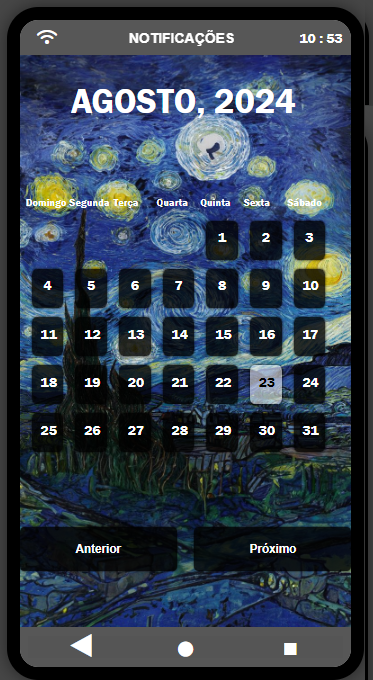

  
   
  

## 🌟 Principais Projetos

1. **[Simulador de Smartphone](https://gahsouzadev.github.io/Simulador-SMARTPHONE/index.html) target="_blank"**
   - Um projeto que simula um smartphone com uma interface intuitiva e apps básicos.
   - Desenvolvido com HTML, CSS e JavaScript.
   - Explore a simulação de um smartphone completo diretamente no seu navegador.

  
  
  
  

### Main skills:
&nbsp;
&nbsp;
&nbsp;
&nbsp;
&nbsp;
&nbsp;
&nbsp;

  
  

