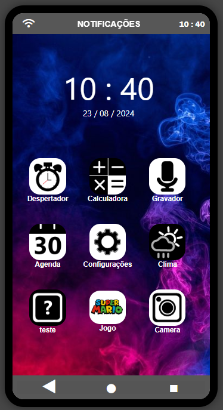
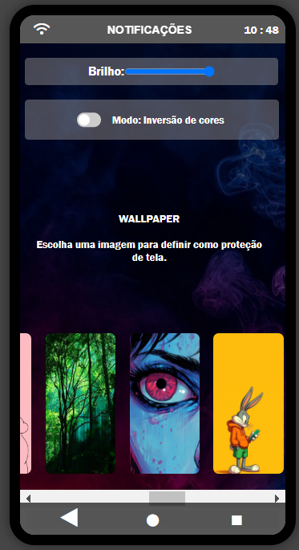
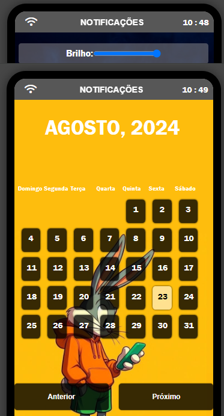
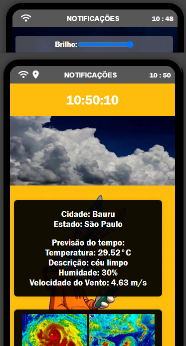

<!-- Início da imagem de cabeçalho gerada pelo Capsule Render -->

<!-- Animação de texto digitado, criada usando o serviço Typing SVG, exibindo informações em português e inglês -->

<!-- Seção para exibir as estatísticas do GitHub e as linguagens mais utilizadas -->

  
  <!-- Estatísticas do GitHub usando GitHub Readme Stats -->
   
  <!-- Exibe as linguagens mais usadas pelo usuário -->
  

<!-- Seção destacando os principais projetos -->
## 🌟 Principais Projetos

1. **[Simulador de Smartphone](https://gahsouzadev.github.io/Simulador-SMARTPHONE/index.html)**
   - Um projeto que simula um smartphone com uma interface intuitiva e apps básicos.
   - Desenvolvido com HTML, CSS e JavaScript.
   - Explore a simulação de um smartphone completo diretamente no seu navegador.

<!-- Imagens de miniaturas para prévia do Simulador de Smartphone, com bordas personalizadas -->

  
  
  
  

<!-- Linha horizontal personalizada para separar as seções -->

<!-- Gráfico de atividades no GitHub gerado com GitHub Readme Activity Graph -->

<!-- Seção de habilidades principais com badges visuais -->
### Main skills:
&nbsp;
&nbsp;
&nbsp;
&nbsp;
&nbsp;
&nbsp;
&nbsp;
&nbsp;

<!-- Botão de LinkedIn para conectar com o usuário -->

  
  

<!-- Imagem de rodapé gerada pelo Capsule Render, igual ao cabeçalho -->

